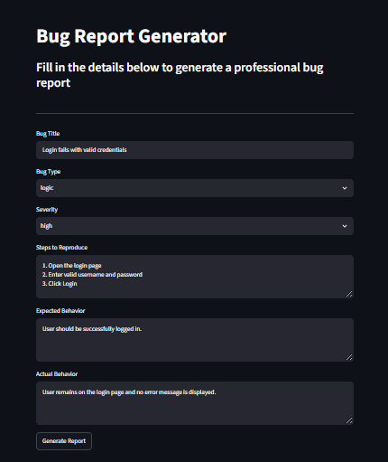

# Bug Report Generator

> A lightweight QA-focused tool for creating structured bug reports.

A simple Streamlit application that helps organize defect information into a consistent bug report format.

This project was built to practice **software testing, defect documentation, test case design, and QA workflow thinking**.

## Live Demo

Try the application:

**[Launch Bug Report Generator](https://bug-report-generator-2vbb8kzkhyytyryven9bmk.streamlit.app/)**

## Key Features

- Generate structured bug reports from user-provided defect information
- Capture essential defect details such as severity, steps to reproduce, expected result, and actual result
- Download generated bug reports for further use
- Simple Streamlit-based interface
- QA-focused test plan covering input validation and boundary scenarios

## Tech Stack

| Technology | Purpose |
|---|---|
| Python | Application development and report generation |
| Streamlit | Web application interface |
| Markdown | Test documentation |

````markdown
## Project Structure

```text
bug-report-generator/
│
├── app.py
├── bug_report_generator.py
├── bug_report_Login_Fail.txt
├── test_plan.md
```text
└── README.md

## QA Testing

Testing for this project focuses on validating user input and identifying potential defects across common and edge-case scenarios.

The current test plan covers:

| Test Case | Scenario | Testing Technique |
|---|---|---|
| TC001 | Submit the form with an empty title | Negative Testing |
| TC002 | Submit the form with a spaces-only title | Negative Testing |
| TC003 | Enter special characters in the title | Input Validation |
| TC004 | Enter 1000+ characters | Boundary Value Analysis |

For the complete test cases and expected results, see the [Test Plan](test_plan.md).

### Testing Approach

The test scenarios were selected to cover:

- **Negative testing** — validating how the application behaves with invalid or missing input
- **Input validation** — checking how user-provided values are handled
- **Boundary value analysis** — testing behavior with unusually large input
- **Edge cases** — exploring inputs that may expose unexpected application behavior

### Test Coverage

The current test plan focuses on input-related scenarios that could affect report generation and usability.

| Area | Coverage |
|---|---|
| Required field validation | Empty and missing input |
| Whitespace handling | Spaces-only input |
| Special characters | Unusual characters in bug titles |
| Boundary testing | Large text input (1000+ characters) |

> **Testing status:** Test cases are currently documented in the test plan. Execution results will be added as testing is completed.

## How It Works

1. Enter the relevant bug information in the application.
2. Select the appropriate bug type and severity.
3. Provide the steps to reproduce the issue.
4. Enter the expected and actual results.
5. Generate the bug report.
6. Download the generated report for further use.

## Application Preview


